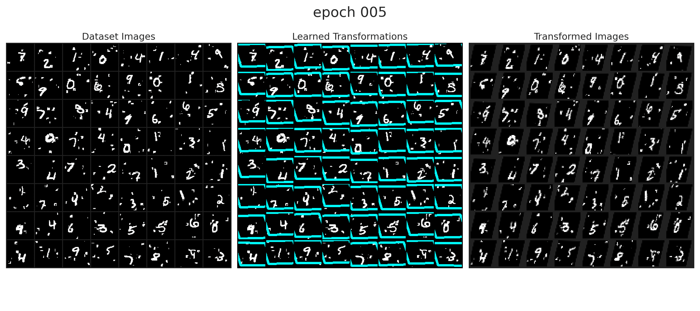
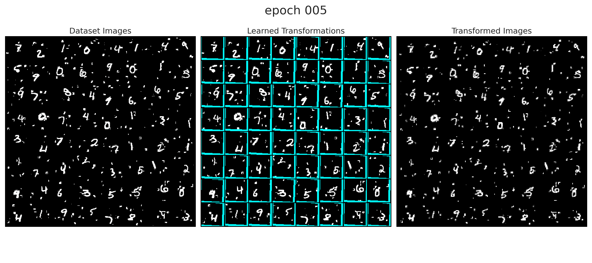

# (Yet another) Pytorch Implementation of Spatial Transformer Networks - With some thoughts


* You might ask why the world needs yet another implementation of spatial transformer networks. Well, I just realized that there are some details worth mentioning which is not being done by other implementations.


# Experiments on Classification Task

## 1. Test input normalization

* The difference in both experiments is

```python
# Experiment 1
def denormalize(inp):
    mean = np.array([0.1307], dtype=np.float32)
    std = np.array([0.3081], dtype=np.float32)
    # mean = np.array([0], dtype=np.float32)
    # std = np.array([1], dtype=np.float32)
    # ...

# Experiment 2
def denormalize(inp):
    # mean = np.array([0.1307], dtype=np.float32)
    # std = np.array([0.3081], dtype=np.float32)
    mean = np.array([0], dtype=np.float32)
    std = np.array([1], dtype=np.float32)
    # ...
```

* To run the experiments, execute

```bash
python classifiction_experiment_1.py
python classifiction_experiment_2.py
```

* This difference should not play a role, however, it does when not properly paying attention to all details. See below


* progress **with** input normalization



* progress **without** input normalization


* launch tensorboard
```bash
tensorboard --logdir . --port 7010
```

* training metrics


* Observations:
    * When the input normalization is applied, the learned transformation seems to downsize the image instead of trying to zoom in on the relevant region. After a couple of epochs, the network collapses.
    * This could be because the input normalization changes the value around the borders and when padding is applied to the image, a bump in the intensity is introduced.
        * one could change that by changing the padding behavior in `x = F.grid_sample(x, grid)`. But I think it is okay to just keep in mind that these problems might occur in practice when applying normalization.
    * After 80 epochs, also the model without input normalization diverges. Note that the optimizer used is SGD with a very large learning rate..


* Note that most implementations out there apply input normalization when providing training code and do not adjust the padding value. See Table below.

| Implementation | Has Training code | Uses Normalization but does not correct padding |
|---|---|---|
| https://pytorch.org/tutorials/intermediate/spatial_transformer_tutorial.html | yes | yes |
| https://github.com/fxia22/stn.pytorch/blob/master/script/test_stn.ipynb | no | not applicable |
| https://github.com/aicaffeinelife/Pytorch-STN | yes | yes |
| https://github.com/kevinzakka/spatial-transformer-network | no | not applicable |
| https://github.com/daviddao/spatial-transformer-tensorflow | no | not applicable |


## 2. Use Adam instead of SGD

```bash
python classifiction_experiment_2.py
python classifiction_experiment_3.py
```

* the default implementation from [here](https://pytorch.org/tutorials/intermediate/spatial_transformer_tutorial.html), which is the version I used to start the code, uses SGD with a learning rate of `0.01`. Maybe this is just too high and causes the model to crash at some point so I am trying ADAM instead.
* To test the robustness of ADAM to the limit, I am letting the experiment run for 150 epochs.

* progress **without** input normalization and SGD with LR `0.01` (Experiment 2).


* progress **without** input normalization and ADAM with LR `0.0001` (Experiment 3).


* training metrics


* Observations:
    * ADAM with the default learning rate performs stable over all epochs


#  Related Links and Projects

* https://pytorch.org/tutorials/intermediate/spatial_transformer_tutorial.html
* https://github.com/fxia22/stn.pytorch/blob/master/script/test_stn.ipynb
* https://github.com/aicaffeinelife/Pytorch-STN
* https://github.com/kevinzakka/spatial-transformer-network
* https://github.com/daviddao/spatial-transformer-tensorflow